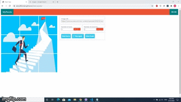

<h2>GitHub Pages</h2>
<a href="https://adcodffunnan.github.io/react_puzzle/">https://adcodffunnan.github.io/react_puzzle/</a>

<h2>About</h2>

This is a puzzle game built using React JS. The game provides the ability to insert the image you want to play with, and it is possible to determine the level of difficulty. It can be played on desktops and mobile devices.

<h2>Cloning and Running the Application in local</h2>

Clone the project into local

<pre>
	<code class="language-bash">git clone https://github.com/adcodFfunnan/weim.git</code>
</pre>

next open your project folder

<pre>
	<code class="language-bash">cd weim</code>
</pre>

and update your laravel version with composer.json

<pre>
	<code class="language-bash">composer update</code>
</pre>

